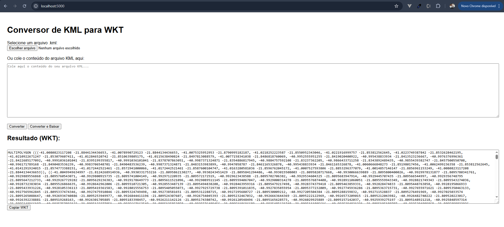

# KML to WKT Converter (via Flask + Docker)

Este projeto é uma aplicação web simples construída com **Flask (Python)** que permite converter arquivos **KML** em representações **WKT** (Well-Known Text), muito úteis em bancos de dados geoespaciais como MySQL, PostGIS, etc.

Você pode:
- Fazer **upload** de arquivos `.kml` ou colar diretamente o conteúdo KML.
- Visualizar o **WKT gerado** diretamente no navegador.
- **Baixar** o WKT em um arquivo `.wkt`.

> O sistema reconhece múltiplos formatos de geometria dentro do KML, incluindo `Polygon`, `LineString`, `MultiGeometry` e anéis internos (furos).


## 🐳 Como executar com Docker

### 1. Subir a aplicação

```bash
Executar: docker-compose up --build

Acessar em: http://localhost:5000
```


## 🖼️ Aplicação

### Exemplo

